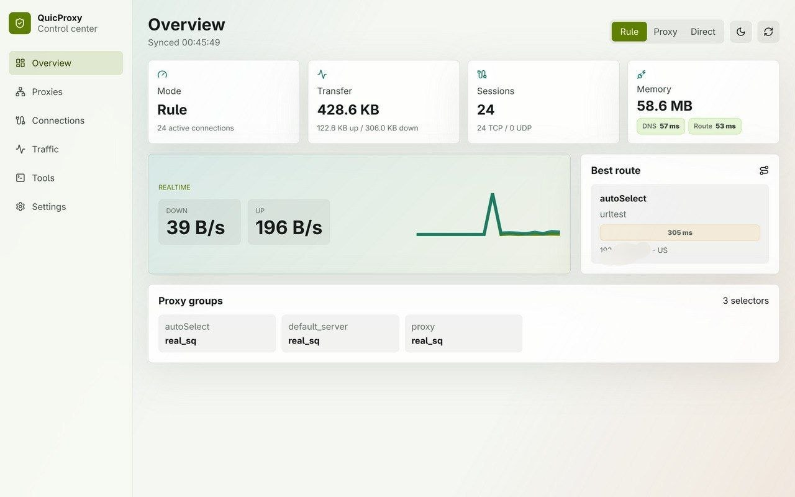
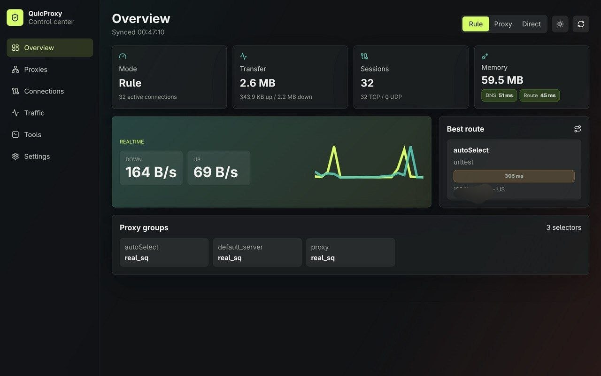

# Quicboard

Quicboard is a React/Vite web UI for the QuicProxy core. It provides a compact control panel for observing traffic, switching router modes, managing proxy selectors, inspecting connections, and testing outbound routes.

[Demo Site](https://spongebob888.github.io/quicboard/)

## Screenshots





## Features

- Realtime overview for transfer totals, upload/download rates, sessions, memory, DNS latency, and route latency.
- Router mode control for `Rule`, `Proxy`, and `Direct`.
- Proxy and selector management with route tracing.
- Active connection list with filtering and close actions.
- Destination traffic sampling via QuicProxy's `/traffic` API.
- Outbound request testing through the `/request` API.
- Configurable refresh interval for live polling.
- Dark and bright themes, persisted locally.

## Requirements

- Node.js with npm.
- A running QuicProxy core with API enabled.

## Quick Start

Install dependencies:

```bash
npm install
```

Start the dev server:

```bash
npm run dev -- --host 0.0.0.0
```

Open:

```text
http://localhost:5173/
```

Set the QuicProxy API address and password in Quicboard Settings. The Settings page also controls the live refresh interval. The value is saved locally and clamped between 1 and 60 seconds.

## Build

Create a production build:

```bash
npm run build
```

Preview the production build:

```bash
npm run preview
```

## QuicProxy API

Quicboard uses these endpoints:

- `GET /observe`
- `GET /outbounds`
- `PUT /selector`
- `GET /mode`
- `PUT /mode`
- `GET /connections`
- `DELETE /connections`
- `GET /traffic`
- `GET /trace`
- `GET /request`
- `GET /quit`

If the API has a password, Quicboard sends it as:

```text
Authorization: Bearer <password>
```

## Traffic Rate Notes

Realtime rates are computed client-side from inbound traffic deltas:

```text
download rate = (current download - previous download) / elapsed seconds
upload rate   = (current upload - previous upload) / elapsed seconds
```

Transfer totals also use inbound stats to avoid double-counting selector and selected outbound traffic.

## Project Structure

```text
quicboard/
  src/
    App.tsx
    main.tsx
    lib/api.ts
    lib/format.ts
    styles/main.css
  index.html
  vite.config.ts
  package.json
```

## Development Notes

- Keep API client changes in `src/lib/api.ts`.
- Add new proxied API routes to `vite.config.ts`.
- Main layout and UI behavior live in `src/App.tsx`.
- Theme styling and responsive layout live in `src/styles/main.css`.
- Do not edit generated directories such as `dist/` or `node_modules/`.
